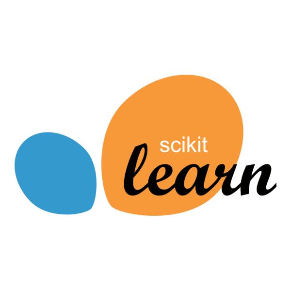
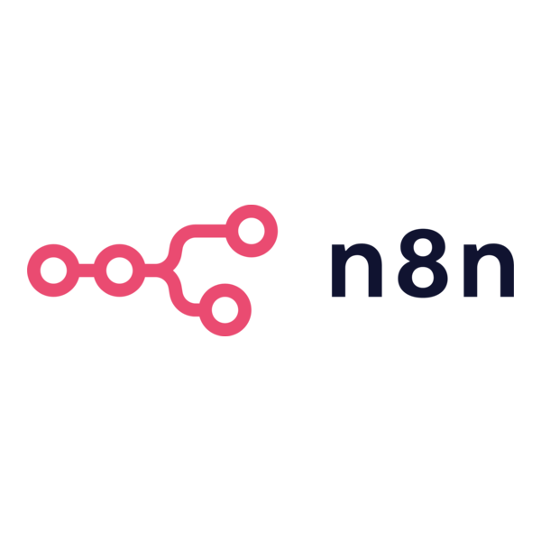

<h1 align="center">Hi 👋, I'm MD. Majidul Islam</h1>
<h3 align="center">AI Engineer & MLOps Expert</h3>

  <b>Skilled AI Engineer & MLOps Expert</b> with expertise in Python, FastAPI, and cloud-based AI solutions. Passionate about building scalable AI systems, automation, and integrating advanced AI technologies to solve real-world problems. Experienced in DevOps, project management, and delivering impactful AI-driven solutions.

---

  
  
  
  

---

## 🧑‍💻 About Me

- 🔭 Currently working as an <b>AI Programmer Data</b> at Sysnova Information Systems Limited
- 🧠 Ex-Software Engineer (AI) at TulipTech Limited
- 🤖 Passionate about AI, MLOps, Automation, and Cloud-based AI solutions
- 🏆 Experienced in project management (monday.com, Jira), DevOps, and automation (Make, Zapier)
- 💬 Ask me about <b>AI, ML, NLP, Generative AI, MLOps, Automation</b>

---

<!-- Portfolio Banner -->

  

---

## 🌐 Portfolio

Check out my full portfolio, projects, and more at:

  <a href="https://www.mazidulmurad.xyz/" target="_blank"><b>www.mazidulmurad.xyz</b></a>

---

## 🚀 Skills & Tools

### Programming Languages

  
  
  
  
  
  

### Machine Learning, Deep Learning, AI

  
  
  
  

### Generative AI & LLM

  
  
  

### Database

  
  
  
  
  
  

### Cloud & DevOps

  
  
  
  
  
  

### Automation

  
  
  
  

### Project Management & Other Tools

  
  
  
  

---

## 💼 Experience

- <b>AI Programmer Data</b> — Sysnova Information Systems Limited (2025–Present)
  - Built and optimized data-driven AI solutions with backend
  - Created and implemented FastAPI backend for AI tools
  - Developed agentic AI solutions and automation for AI agents
  - Big Data processing with AI

- <b>Software Engineer (AI)</b> — TulipTech Limited (2022–2025)
  - Developed & deployed AI-driven applications (Python, FastAPI, MLOps)
  - Automated ML model deployment workflows
  - Managed Azure-based AI services
  - Integrated Azure Cognitive Services, MongoDB, CrewAI for conversational AI
  - Project coordination, DevOps, and automation

- <b>Officer Cadet</b> — Bangladesh Navy (2016–2018)
  - Leadership, teamwork, crisis management, and technical training

---

## 🛠️ Projects
- <b>NHS Medicine Parser (Automation):</b> Parsed and extracted critical information from NHS medical records.
- <b>DMD+D Medicine AI Processor:</b> AI-powered tool for processing and analyzing drug data.
- <b>Care Home Care Plan and Care AI Agents:</b> AI-driven care plan system and AI agents for personalized care.
- <b>Project Management Automation:</b> monday.com, Atlassian Jira, Make, Zapier.

---

## 🎓 Certifications
- Project Management Admin – monday.com
- Industrial Data Science and Machine Learning – Hr Venture
- Make.com (My badges)
- Cyber Security and Ethical Hacking – Arena Web Security

---

## 📚 Research
- <b>Internet Banking Cyber Security in Bangladesh</b> — IEEE SEM Vol-12, 2024
- <b>Multi Factor Authentication Kerberos</b>

---

## 📫 Contact

- <b>Email:</b> contact.majidul.islam@gmail.com
- <b>Phone:</b> +8801521498321
- <b>GitHub:</b> <a href="https://github.com/Majidul17068">Majidul17068</a>
- <b>LinkedIn:</b> <a href="https://linkedin.com/in/majidulmurad">majidulmurad</a>
- <b>Portfolio:</b> <a href="https://www.mazidulmurad.xyz/">www.mazidulmurad.xyz</a>
